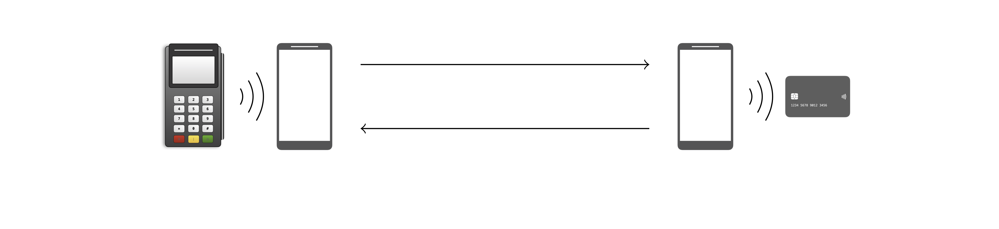

By [David Basin](https://people.inf.ethz.ch/basin/), [Ralf Sasse](https://people.inf.ethz.ch/rsasse/), and [Jorge Toro](https://jorgetp.github.io/) 
[Department of Computer Science](http://www.inf.ethz.ch/), [ETH Zurich](https://www.ethz.ch/en)

EMV, named after its founders Europay, Mastercard, and Visa, is the international protocol standard for smartcard payment. As of December 2019, EMV is being used in over 9 billion debit and credit cards worldwide. Despite the standard's advertised security, various issues have been previously uncovered, deriving from logical flaws that are hard to spot in EMV's lengthy and complex specification, running over 2,000 pages.

We present a comprehensive model of EMV, specified in the [Tamarin](https://tamarin-prover.github.io/) verification tool. Using our model, we automatically identified several authentication flaws. One of the encountered flaws, present in the Visa contactless protocol, leads to a **PIN bypass** attack for transactions that are presumably protected by cardholder verification, typically those whose amount is above the local PIN-less upper limit (e.g., currently 80 CHF in Switzerland). This means that your PIN won't prevent criminals from using your Visa contactless card to pay for their purchase, even if the amount is above the mentioned limit. To carry out the attack, the criminals must have access to your card, either by stealing it/finding it if lost, or by holding an NFC-enabled phone near it.

This work passed peer-review successfully and will be presented at the [*42nd IEEE Symposium on
Security and Privacy (S&P 2021)*](https://www.ieee-security.org/TC/SP2021/index.html). Watch a talk preview on [<i class="fa fa-youtube-play"></i> YouTube](https://youtu.be/HrBgPIiqqf8).

## Demonstrating the attacks

To demonstrate how easy it is to exploit the vulnerabilities we found, we developed a proof-of-concept Android application. Our app implements [man-in-the-middle (MITM)](https://en.wikipedia.org/wiki/Man-in-the-middle_attack) attacks on top of a [relay attack](https://en.wikipedia.org/wiki/Relay_attack) architecture, displayed below. The MITM attacks modify the terminal's commands and the card's responses before delivering them to the corresponding recipient.

The outermost devices are the payment terminal (on the left) and the victim's contactless card (on the right). The phone near the payment terminal is the attacker's Card emulator device and the phone near the victim's card is the attacker's POS emulator device. The attacker's devices communicate with each other over WiFi, and with the terminal and the card over NFC.

Our app does not require root privileges or any hacks to Android and we have successfully used it on Google Pixel and Huawei devices.

### Bypassing the PIN

This attack allows criminals to complete a purchase over the PIN-less limit with a victim's Visa contactless card without knowing the card's PIN. The attack consists in a modification of a card-sourced data object --the Card Transaction Qualifiers-- before delivering it to the terminal. The modification instructs the terminal that:
* PIN verification is not required, and
* the cardholder was verified on the consumer's device (e.g., a smartphone).

Technical details can be found in our paper and a video demonstration of the attack for a **200 CHF** transaction is given below.

<iframe width="560" height="315" src="https://www.youtube-nocookie.com/embed/JyUsMLxCCt8" frameborder="0" allow="accelerometer; autoplay; encrypted-media; gyroscope; picture-in-picture" allowfullscreen></iframe>

We also tested the attack in live terminals at actual stores. For all of our attack tests, we used our own credit/debit cards; no merchant or any other entities were defrauded.

There are six EMV contactless protocols and each of them corresponds to one of the card brands Mastercard, Visa, American Express, JCB, Discover, and UnionPay. Our PIN bypass attack applies to the Visa protocol and (possibly) the Discover and the UnionPay ones, but we have not tested these two in practice.

### Making the terminal accept fake offline transactions

This attack allows a criminal to use their own card to complete a low-value, offline transaction, while not being actually charged. The attack consists in a modification of a card-produced data object --the Application Cryptogram-- before delivering it to the terminal. The terminal cannot detect this modification; only the bank can, yet after the consumer/criminal is long gone with the goods.

This attack applies to both the Visa and Mastercard protocols. In the case of the latter, it only applies to transactions with (likely old) cards that do not support the CDA authentication method. For ethical reasons, we did not test this second attack in practice.

## FAQ

What cards are affected by the PIN bypass attack?

Modern contactless cards that run the Visa protocol, including Visa Credit, Visa Debit, Visa Electron, and V Pay cards. Discover and UnionPay might be affected too.

Why is it possible to bypass the PIN in Visa cards?

The card does not authenticate the data object that defines the cardholder verification method to be used, thus modifying this object is possible without detection.

Is Mastercard exposed to the PIN bypass attack?

No. In a Mastercard transaction, the card authenticates the data object that defines the cardholder verification method to be used, thus no modification of this object is possible without detection.

What cards are affected by the offline attack?

We have not tested this attack in practice and thus we don't know for certain. Based on our analysis, Visa and old Mastercard cards seem to be exposed.

What role did Tamarin play in this research?

Tamarin is a state-of-the-art verification tool. With it, we analysed the full execution flow of an EMV transaction with unboundedly many executions occurring simultaneously in an adversarial environment, where all messages exchanged between the terminal and the card can be modified/blocked/injected. The outcome of this analysis were the two novel attacks we focus on in the paper, as well as the rediscovery of existing ones. We also used Tamarin to design and verify (under all adversarial conditions explained above) defenses to all attacks.

There have been many attacks on EMV before: what makes this different?

Practical attacks reported before are either conspicuous and thus hard to exploit in practice, or do not seem lucrative for criminals. Our attack, which allows for high-value fraudulent transactions, looks just like a commercial payment app such as Apple/Google Pay, thus evading detection.

What went wrong?  How can such problems be avoided in the future?

Critical data sent by the card during a transaction are not authenticated. Complex systems such as EMV must be analysed by formal tools, like model checkers. Humans cannot deal with the volume of execution steps and branches a complex system has, and so security breaches are often missed.

Should we protect our cards in a “metal wallet” to prevent them being read remotely?

This might help.  Although you still have problems if they are lost or stolen.

What actions should I as a citizen take now to protect myself?

Protection measures recommended by banks apply. Block your card immediately upon realization it is lost or stolen. Check your bank statement regularly, and immediately report to your bank whenever you see an unrecognized transaction. Additionally, we recommend that, whenever you carry a Visa card, make sure nobody is holding a device near it against your will. Also, be aware of your back pocket in queues.

Do you have follow up plans?

We plan to further refine our formal model in order to consider even more powerful adversaries. Also, we are open to working with Visa and EMV in implementing the fixes we have proposed as well as in verifying future versions of the standard.

Where do I find the Android app?

Nowhere. We do not make it available.

<!--

How do I cite this work?

This work has been accepted by a peer-review process for publication at the <i>42nd IEEE Symposium on Security and Privacy (S&P 2021)</i>. Thus the citation must refer to this symposium.

## Acknowledgments

Parts of the code of our app were inspired by the apps [EMVemulator](https://github.com/MatusKysel/EMVemulator), [EMV-Card ROCA-Keytest](https://github.com/johnzweng/android-emv-key-test), and [SwipeYours](https://github.com/dimalinux/SwipeYours). We thank their authors. We also thank [EFT Lab](https://www.eftlab.com/) for making the lists of EMV tags and CA public keys available.-->
