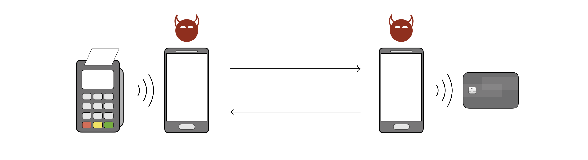

EMV, named after its founders Europay, Mastercard, and Visa, is the international protocol standard for in-store smartcard payment. In December 2020, EMVCo [reported](https://www.emvco.com/wp-content/uploads/documents/EMVCo-Annual-Report-2020.pdf) 9.89 billion EMV cards in circulation worldwide. Despite the standard's advertised security, various issues have been previously uncovered, deriving from logical flaws that are hard to spot in EMV's lengthy and complex specification, running over 2,000 pages.

We have specified a comprehensive model of the EMV protocol, using the [Tamarin](https://tamarin-prover.github.io/) model checker. Using our model, we identified several authentication flaws that lead to two critical attacks: one affecting Visa cards and another affecting Mastercard cards.

[**The attack on Visa**](#attack-on-visa) allows criminals to complete a purchase over the PIN-less limit with a victim's Visa contactless card without knowing the card's PIN. In other words, *the PIN in your Visa card is useless* as it won't protect your card from being used for fraudulent, high-value purchases.

[**The attack on Mastercard**](#attack-on-mastercard) allows criminals to trick a terminal into transacting with a victim's  Mastercard contactless card while believing it to be a Visa card. This *card brand mixup* has critical consequences since it can be used in combination with the PIN bypass for Visa to also bypass the PIN for Mastercard cards. As a result of our disclosure process, Mastercard has since implemented defense mechanisms, which we experimentally confirmed as effective against the attack.

## Demonstrating the attacks

To demonstrate the feasibility of the attacks, we developed a proof-of-concept Android application. Our app implements the attacks as [man-in-the-middle](https://en.wikipedia.org/wiki/Man-in-the-middle_attack) attacks built on top of a [relay attack](https://en.wikipedia.org/wiki/Relay_attack) architecture, using two NFC-enabled phones.

The outermost devices are the payment terminal (on the left) and the victim's contactless card (on the right). The phone near the payment terminal is the attacker's card emulator device and the phone near the victim's card is the attacker's POS emulator device. The attacker's devices communicate with each other over WiFi, and with the terminal and the card over NFC.

For the attacks to work, the criminals must have access to the victim's card, either by stealing it, finding it if lost, or by holding the POS emulator near it if still in the victim's possession. The attacks work by modifying the terminal's commands and the card's responses before delivering them to the corresponding recipient.

Our app does not require root privileges or any hacks to Android. We have used it on Google Pixel 2 XL and Huawei P Smart 2019 devices.

### Attack on Visa

The attack consists in a modification of the Card Transaction Qualifiers (CTQ, a card-sourced data object), before delivering it to the terminal. The modification instructs the terminal that:
* PIN verification is not required, and
* the cardholder was verified on the consumer's device (e.g., a smartphone).

We have successfully tested this attack with Visa Credit, Visa Debit, Visa Electron, and V Pay cards. A video demonstration for a **200 CHF** transaction is given below. <!--We also tested the attack in live terminals at actual stores. For all of our attack tests, we used our own credit/debit cards. No merchant or any other entities were defrauded.-->

<!-- <iframe src="https://www.youtube-nocookie.com/embed/JyUsMLxCCt8" frameborder="0" allow="accelerometer; autoplay; encrypted-media; gyroscope; picture-in-picture" allowfullscreen></iframe> -->
<video width="100%" poster="assets/img/Visa200CHF-poster.png" controls>
	<source src="assets/video/Visa200CHF.mp4" type="video/mp4">
	<source src="assets/video/Visa200CHF.webm" type="video/webm">
	Your browser does not support the video tag.
</video>

This attack may also affect Discover and UnionPay cards. Our findings have been covered by [ETH Zurich](https://ethz.ch/en/news-and-events/eth-news/news/2020/09/outsmarting-the-pin-code.html), [ACM TechNews](https://technews.acm.org/archives.cfm?fo=2020-09-sep/sep-04-2020.html#1130993), [Schweizer Radio und Fernsehen (SRF)](https://www.srf.ch/news/schweiz/eth-forscher-warnen-sicherheitsluecke-bei-visa-kreditkarten-entdeckt), [The Hacker News](https://thehackernews.com/2020/09/emv-payment-card-pin-hacking.html), [ZDNet](https://www.zdnet.com/article/academics-bypass-pins-for-visa-contactless-payments/), [heise](https://www.heise.de/security/meldung/Zahlen-ohne-PIN-Forscher-knacken-Visas-NFC-Bezahlfunktion-4881555.html), and a full technical report is given in our paper:

<b>The EMV Standard: Break, Fix, Verify</b> 
David Basin, Ralf Sasse, and Jorge Toro-Pozo 
<em>42nd IEEE Symposium on Security and Privacy (S&P), 2021</em> 

<a href="https://arxiv.org/pdf/2006.08249.pdf"><i class="far fa-file-pdf"></i> PDF (arXiv)</a> | 
<a href="https://doi.ieeecomputersociety.org/10.1109/SP40001.2021.00037"><i class="fas fa-link"></i> DOI</a> | 
<a href="https://www.computer.org/csdl/api/v1/citation/bibtex/proceedings/1mbmGIGBpK0/893400a629"><i class="fas fa-link"></i> BibTex</a> | 
<a href="https://github.com/EMVrace/EMVerify"><i class="fab fa-github"></i> Tamarin model</a>

### Attack on Mastercard

This attack primarily consists in the replacement of the card's legitimate Application Identifiers (AIDs) with the Visa AID `A0000000031010` to deceive the terminal into activating the Visa kernel. The attacker then simultaneously performs a Visa transaction with the terminal and a Mastercard transaction with the card. In the Visa transaction, the attacker applies the aforementioned attack on Visa.

For this attack to work, the terminal's authorization request must reach the card-issuing bank. Requirements for this include:
* the terminal does not decline offline even if the card number (PAN) and the AIDs indicate different card brands, and
* the merchant's acquirer routes the transaction authorization request to a payment network that can process Mastercard cards.

We have successfully tested this attack with Mastercard Credit and Maestro cards. A video demonstration for a **400 CHF** transaction is given below.

<!-- <iframe src="https://www.youtube-nocookie.com/embed/8d7UgIiMRBU" frameborder="0" allow="accelerometer; autoplay; encrypted-media; gyroscope; picture-in-picture" allowfullscreen></iframe> -->
<video width="100%" poster="assets/img/Maestro400CHF-poster.png" controls>
	<source src="assets/video/Maestro400CHF.mp4" type="video/mp4">
	<source src="assets/video/Maestro400CHF.webm" type="video/webm">
	Your browser does not support the video tag.
</video>

This attack may also affect JCB and American Express cards. Our research has been featured by [ETH Zurich](https://ethz.ch/en/news-and-events/eth-news/news/2021/02/security-flaw-detected-for-the-second-time-in-credit-cards.html), [ACM TechNews](https://technews.acm.org/archives.cfm?fo=2021-02-feb/feb-26-2021.html#1151729), [The Hacker News](https://thehackernews.com/2021/02/new-hack-lets-attackers-bypass.html), and a full technical report is given in our paper:

<b>Card Brand Mixup Attack:</b> <b>Bypassing the PIN in non-Visa cards by Using Them for Visa Transactions</b> 
David Basin, Ralf Sasse, and Jorge Toro-Pozo 
<em>30th USENIX Security Symposium, 2021</em> 

<a href="https://www.usenix.org/system/files/sec21fall-basin.pdf"><i class="far fa-file-pdf"></i> PDF</a> | 
<a href="https://www.usenix.org/biblio/export/bibtex/272165"><i class="fas fa-download"></i> BibTex</a> | 
<a href="https://github.com/EMVrace/EMVerify-PAN-routing"><i class="fab fa-github"></i> Tamarin model</a>

<!--
### Making the terminal accept fake offline transactions

This attack allows a criminal to use their own card to complete a low-value, offline transaction, while not being actually charged. The attack consists in a modification of a card-produced data object --the Application Cryptogram-- before delivering it to the terminal. The terminal cannot detect this modification; only the bank can, yet after the consumer/criminal is long gone with the goods.

This attack applies to both the Visa and Mastercard protocols. In the case of the latter, it only applies to transactions with (likely old) cards that do not support the CDA authentication method. For ethical reasons, we did not test this second attack in practice.-->
 
## FAQ

<!--

What cards are affected by the PIN bypass attack?

Modern contactless cards that run the Visa protocol, including Visa Credit, Visa Debit, Visa Electron, and V Pay cards. Discover and UnionPay might be affected too.

Why is it possible to bypass the PIN in Visa cards?

The card does not authenticate the data object that defines the cardholder verification method to be used, thus modifying this object is possible without detection.

Is Mastercard exposed to the PIN bypass attack?

No. In a Mastercard transaction, the card authenticates the data object that defines the cardholder verification method to be used, thus no modification of this object is possible without detection.

What cards are affected by the offline attack?

We have not tested this attack in practice and thus we don't know for certain. Based on our analysis, Visa and old Mastercard cards seem to be exposed.

-->

What cards are affected by these attacks?

We have successfully bypassed the PIN for Visa Credit, Visa Debit, Visa Electron, V Pay, Mastercard Credit, and Maestro cards. Further EMV cards may be affected but we have no proof of this in the wild.

Has there been any response by the affected companies?

We have disclosed the attacks to both Visa and Mastercard. As a result of our successful disclosure process with Mastercard, the payment network has since implemented and rolled out defense mechanisms against the attack affecting their cards.

What role did Tamarin play in this research?

Tamarin is a state-of-the-art verification tool. With it, we analysed the full execution flow of an EMV transaction with unboundedly many executions occurring simultaneously in an adversarial environment, where all messages exchanged between the terminal and the card can be read/blocked/injected. The outcome of this analysis was the identification of the novel attacks we focus here, as well as the rediscovery of existing ones. We also used Tamarin to design and verify (under all adversarial conditions explained above) defenses to all attacks.

There have been many attacks on EMV before, what makes these different?

Practical attacks reported before are either conspicuous and thus hard to exploit in practice, or do not seem lucrative for criminals due to being possible for low-value purchases only. Our attacks allow criminals to carry out high-value fraudulent transactions and are performed using an app that looks just like a commercial payment app such as Apple Pay or Google Pay, thus evading detection.

What went wrong? How can such problems be avoided in the future?

Critical data sent by the card during a transaction are not authenticated. Complex systems such as EMV must be analyzed by automated tools, like model checkers. Humans cannot deal with the volume of execution steps and branches a complex system has, and so security breaches are often missed.

Should we protect our cards in a “metal wallet” to prevent them being read remotely?

This might help. Although you still have problems if they are lost or stolen.

What actions should I as a citizen take now to protect myself?

Protection measures recommended by banks apply. Block your card immediately upon realization it is lost or stolen. Check your bank statement regularly, and immediately report to your bank whenever you see an unrecognized transaction. Additionally, whenever you are carrying an EMV contactless card, make sure nobody is holding a device near it against your will. Also, be aware of your back pocket.

<!--

Do you have follow up plans?

We plan to further refine our formal model in order to consider even more powerful adversaries. Also, we are open to working with Visa and EMV in implementing the fixes we have proposed as well as in verifying future versions of the standard.

-->

Where do I find the Android app?

Nowhere. We do not make it available.

<!--
## Acknowledgments

Parts of the code of our app were inspired by the apps [EMVemulator](https://github.com/MatusKysel/EMVemulator), [EMV-Card ROCA-Keytest](https://github.com/johnzweng/android-emv-key-test), and [SwipeYours](https://github.com/dimalinux/SwipeYours). We thank their authors. We also thank [EFT Lab](https://www.eftlab.com/) for making the lists of EMV tags and CA public keys available.-->

## Team

Prof. Dr. [David Basin](https://www.inf.ethz.ch/personal/basin/) 
Dr. [Ralf Sasse](https://people.inf.ethz.ch/rsasse/) 
Dr. [Jorge Toro](https://jorgetp.github.io/)

[Institute of Information Security](https://informationsecurity.ethz.ch/) 
[Department of Computer Science](https://inf.ethz.ch/) 
[ETH Zurich](https://www.ethz.ch/en)
